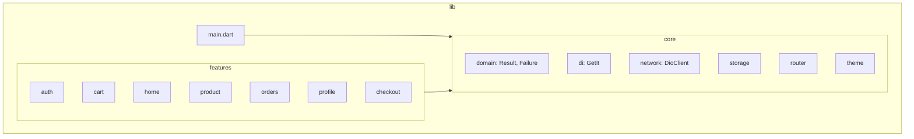
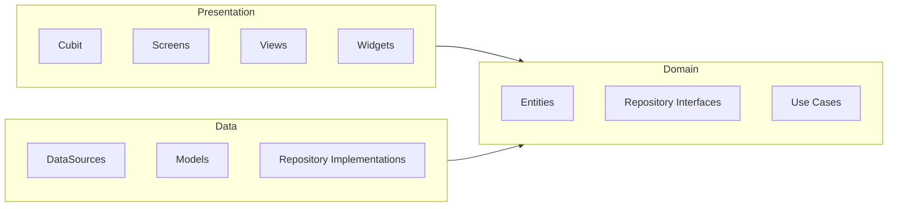
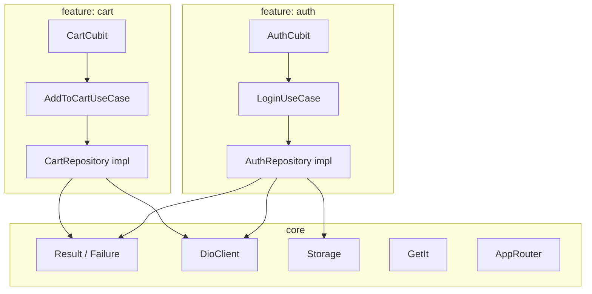

# Architecture

This document describes the project structure and architectural patterns used in Hungry. Use it as a reference when building new features or starting a new project.

## Project Structure Overview

## lib/ Division

| Folder | Purpose |
|--------|---------|
| `core/` | Shared utilities, network, storage, theme, DI, and cross-cutting concerns. No feature-specific logic. |
| `features/` | Feature modules, each with its own domain, data, and presentation layers. |
| `main.dart` | App entry point, DI init, theme, routing, and error handling setup. |
| `splash/` | Splash screen and initial load flow. |
| `onboarding/` | Onboarding screens. |

## Clean Architecture Layers

Each feature follows Clean Architecture with three layers:

### Dependency Flow

- **Domain** – No dependencies on other layers. Contains entities, repository interfaces, and use cases. May depend on `core/domain` for Result, Failure.
- **Data** – Depends on domain. Implements repositories, calls remote/local datasources, maps models to entities.
- **Presentation** – Depends on domain only. Uses use cases via Cubit; never imports data layer directly.

### Layer Responsibilities

| Layer | Contains | Depends On |
|-------|----------|------------|
| Domain | Entities, repository interfaces, use cases | `core/domain` (Result, Failure) |
| Data | DataSources, models, repository implementations | Domain, core (network, storage) |
| Presentation | Cubit, screens, views, widgets, listeners | Domain (use cases, entities) |

## Core vs Features

- **core** provides Result/Failure, network, storage, DI, router, and other shared services.
- **features** depend on core and their own domain; they do not depend on each other.

## Examples from the Codebase

### Auth Feature

- **Domain:** `AuthRepository` (interface), `LoginUseCase`, `RegisterUseCase`, `LogoutUseCase`, `UserEntity`
- **Data:** `AuthRepositoryImpl`, `AuthRemoteDataSource`, maps API response to `UserEntity`
- **Presentation:** `AuthCubit`, `LoginScreen`, `SignupScreen`, `LoginForm`, `AuthListener`

### Cart Feature

- **Domain:** `CartRepository` (interface), `AddToCartUseCase`, `GetCartItemsUseCase`, `CartItemEntity`, `CartData`
- **Data:** `CartRepositoryImpl`, `CartRemoteDataSource`, `CartItemModel`
- **Presentation:** `CartCubit`, `CartScreen`, `CartViewFactory`, `CartItem` widget, `CartListener`

## Result / Failure

All use cases return `Result<T>` from `lib/core/domain/result.dart`:

- `Success<T>` – operation succeeded, contains data
- `FailureResult<T>` – operation failed, contains `Failure`

Failure types live in `lib/core/domain/failures.dart`:

- `NetworkFailure`, `ServerFailure`, `CacheFailure`, `AuthFailure`, `UnimplementedFailure`

Use `result.when(success: (data) => ..., onFailure: (f) => ...)` to handle both cases. This keeps error handling consistent across all features.

## Dependency Injection

`lib/core/di/injection.dart` registers all dependencies with GetIt (`sl`). Use cases, repositories, datasources, and Cubits are registered there. Inject dependencies via constructor; avoid direct instantiation or singletons outside DI.
